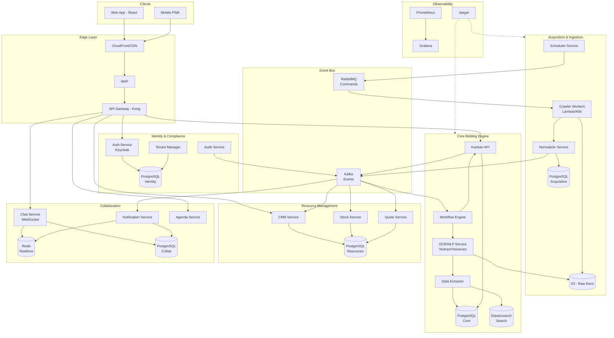

# TDD - CotAI: Plataforma de Gestão de Licitações

## 1. Visão Geral da Arquitetura

Arquitetura Cloud-Native baseada em microsserviços com isolamento multi-tenant, comunicação híbrida (síncrona/assíncrona) e processamento distribuído.

---

## 2. Bounded Contexts (DDD)

| Contexto | Responsabilidade | Agregados Principais |
|----------|------------------|----------------------|
| **Acquisition** | Crawlers, ingestão de editais (PNCP), normalização | Edital, FonteDados, JobIngestao |
| **Core Bidding** | Motor de workflow Kanban, OCR/NLP, automação | Licitacao, Cotacao, ItemEdital, Workflow |
| **Resource Mgmt** | CRM fornecedores, estoque, insumos | Fornecedor, Produto, Estoque, Cotação |
| **Collaboration** | Chat (WebSocket), notificações, agenda | Conversa, Mensagem, Notificacao, Evento |
| **Identity** | Multi-tenant, RBAC, auditoria, compliance | Tenant, Usuario, Perfil, LogAuditoria |

---

## 3. Decisões Técnicas Críticas

### 3.1 Isolamento de Tenants: **Schema-per-Tenant**

**Decisão:** Schema-per-tenant com pool de conexões por tenant.

| Critério | Database-per-tenant | Schema-per-tenant (✓) |
|----------|---------------------|----------------------|
| Isolamento | Máximo | Alto (Row-Level Security adicional) |
| Custo | Alto (conexões/recursos) | Otimizado |
| Backup/Restore | Simples por tenant | Por schema ou seletivo |
| Escalabilidade | Limitada | Melhor densidade |

**Implementação:**
- PostgreSQL com schemas dinâmicos (`tenant_{uuid}`)
- Middleware resolve tenant via JWT claim ou subdomain
- Row-Level Security (RLS) como camada extra
- Tenants enterprise: migração para database dedicado

### 3.2 Comunicação Inter-serviços

| Padrão | Uso | Tecnologia |
|--------|-----|------------|
| **Síncrono** | Queries, validações críticas | REST (público) / gRPC (interno) |
| **Assíncrono** | Eventos de domínio, processamento pesado | RabbitMQ (comandos) + Kafka (eventos) |

**Justificativa:**
- RabbitMQ: filas de trabalho (crawlers, OCR) com retry e DLQ
- Kafka: event sourcing do ciclo de vida da licitação (auditoria)

### 3.3 Escalabilidade de Crawlers

**Estratégia:** Serverless + Workers distribuídos

```
┌─────────────────────────────────────────────────────────┐
│  Scheduler (Cron)  →  RabbitMQ  →  Worker Pool (K8s)    │
│         ↓                              ↓                │
│  AWS EventBridge      Autoscaling HPA (CPU/Queue depth) │
│         ↓                              ↓                │
│  Lambda (burst)       Pods 2-50 (processamento OCR)     │
└─────────────────────────────────────────────────────────┘
```

- **Crawlers leves (API PNCP):** AWS Lambda / Cloud Functions
- **Processamento pesado (OCR/NLP):** Kubernetes Jobs com GPU (opcional)
- **Backpressure:** Circuit breaker + rate limiting por fonte

---

## 4. Diagrama de Arquitetura



---

## 5. Descrição dos Serviços

| Serviço | Responsabilidade | Database | Stack |
|---------|------------------|----------|-------|
| **Frontend** | Aplicação web (portal do cliente), PWA e portal de fornecedores; interfaces administrativas | - | React 18 + TypeScript + TailwindCSS; Next.js |
| **API Gateway** | Roteamento, rate limiting, auth | - | Kong + Redis |
| **Auth Service** | Autenticação, tokens, sessões | PostgreSQL | Keycloak / Node.js |
| **Tenant Manager** | CRUD tenants, provisioning schemas | PostgreSQL | Go |
| **Audit Service** | Logs de auditoria, compliance LGPD | Kafka → S3/ClickHouse | Go |
| **Scheduler** | Agendamento de crawlers | Redis | Node.js + BullMQ |
| **Crawler Workers** | Coleta editais (PNCP, portais) | - | Python + Scrapy |
| **Normalizer** | Padronização dados, dedup | PostgreSQL | Python |
| **Workflow Engine** | Orquestração estados Kanban | PostgreSQL + Redis | Go + Temporal.io |
| **OCR/NLP Service** | Extração texto de PDFs | S3 | Python + Tesseract/AWS Textract |
| **Data Extractor** | NLP para itens, prazos, valores | Elasticsearch | Python + spaCy |
| **Kanban API** | CRUD licitações, transições | PostgreSQL | Node.js + NestJS |
| **CRM Service** | Gestão fornecedores | PostgreSQL | Node.js + NestJS |
| **Stock Service** | Controle estoque/insumos | PostgreSQL | Node.js |
| **Quote Service** | Cotações com fornecedores | PostgreSQL | Node.js |
| **Chat Service** | Mensageria real-time | PostgreSQL + Redis | Node.js + Socket.io |
| **Notification Service** | Push, Email, SMS | PostgreSQL | Node.js + Firebase |
| **Agenda Service** | Eventos, lembretes | PostgreSQL | Node.js |

---

## 6. Fluxo do Core: Jornada do Edital

```
┌──────────────────────────────────────────────────────────────────────────┐
│                        FLUXO AUTOMATIZADO DO KANBAN                      │
└──────────────────────────────────────────────────────────────────────────┘

[1] DESCOBERTA (Acquisition)
    ├── Scheduler dispara job (cron: */30 * * * *)
    ├── Crawler consulta API PNCP (filtros: modalidade, região, segmento)
    ├── Normalizer: dedup, enriquecimento, validação
    └── Evento: EditalDescoberto → Kafka

[2] RECEBIDO (Kanban Col. 1) ⏱️ Auto
    ├── Workflow Engine consome evento
    ├── Cria registro Licitacao (status: RECEBIDO)
    ├── Download PDF → S3
    └── Dispara: ProcessarEdital → RabbitMQ

[3] ANALISANDO (Kanban Col. 2) ⏱️ Auto
    ├── OCR Service extrai texto do PDF
    ├── NLP Extractor identifica:
    │   ├── Itens (descrição, quantidade, unidade)
    │   ├── Prazos (abertura, entrega, impugnação)
    │   ├── Valores estimados
    │   └── Requisitos (certidões, qualificações)
    ├── Match com catálogo interno (similaridade > 0.8)
    ├── Score de aderência calculado
    └── Transição automática se score > threshold

[4] COTAR (Kanban Col. 3) ⚡ Manual/Auto
    ├── Se match alto: auto-associa fornecedores do CRM
    ├── Notifica equipe comercial (push + email)
    ├── Usuário revisa itens extraídos
    ├── Dispara cotações para fornecedores
    └── Aguarda respostas (SLA: 48h)

[5] COTADO (Kanban Col. 4) ⚡ Manual
    ├── Fornecedores respondem via portal/email
    ├── Sistema consolida propostas
    ├── Calcula melhor cenário de preços
    ├── Gera proposta final para revisão
    └── Marca como pronto para submissão

[6] SEM RESPOSTA (Kanban Col. 5) ⏱️ Auto
    ├── Timeout de SLA atingido sem cotação viável
    ├── Notifica gestor
    └── Arquiva com motivo (registra para analytics)
```

### Regras de Transição Automática

| De → Para | Trigger | Condição |
|-----------|---------|----------|
| Recebido → Analisando | Evento OCR iniciado | PDF baixado com sucesso |
| Analisando → Cotar | Extração completa | Score aderência ≥ 70% |
| Analisando → Sem Resposta | Extração completa | Score < 30% ou fora do segmento |
| Cotar → Cotado | Cotações recebidas | ≥ 1 proposta válida |
| Cotar → Sem Resposta | Timeout SLA | 48h sem propostas |

---

## 7. Segurança e Compliance

| Camada | Controle |
|--------|----------|
| **Rede** | VPC isolada, Security Groups, WAF |
| **API** | OAuth 2.0 + JWT, Rate Limiting, CORS |
| **Dados** | Encryption at rest (AES-256), TLS 1.3 |
| **Tenant** | Schema isolation + RLS + Audit trail |
| **LGPD** | Consent management, data retention policies, right to erasure |

---

## 8. Escalabilidade e Alta Disponibilidade

| Componente | Estratégia |
|------------|------------|
| **API Gateway** | Multi-AZ, auto-scaling |
| **Microsserviços** | Kubernetes HPA (CPU 70%, memory 80%) |
| **Crawlers** | Lambda (burst) + K8s Jobs (sustained) |
| **Databases** | RDS Multi-AZ, Read Replicas |
| **Cache** | Redis Cluster (6 nodes) |
| **Mensageria** | RabbitMQ cluster (3 nodes), Kafka (3 brokers) |

**RPO/RTO:** 15min / 1h (tier padrão) | 5min / 15min (enterprise)

---

## 9. Stack Tecnológica Consolidada

| Camada | Tecnologia |
|--------|------------|
| **Frontend** | React 18 + TypeScript + TailwindCSS |
| **API Gateway** | Kong / AWS API Gateway |
| **Backend** | Node.js (NestJS), Go, Python |
| **Banco Relacional** | PostgreSQL 15 |
| **Search** | Elasticsearch 8 |
| **Cache** | Redis 7 |
| **Mensageria** | RabbitMQ 3.12 + Kafka 3.x |
| **OCR** | AWS Textract / Tesseract 5 |
| **NLP** | spaCy + modelos custom |
| **Orquestração** | Kubernetes (EKS) + Temporal.io |
| **Observabilidade** | Prometheus + Grafana + Jaeger |
| **IaC** | Terraform + Helm |